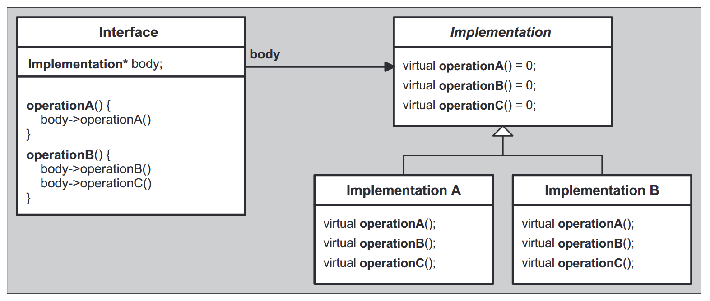
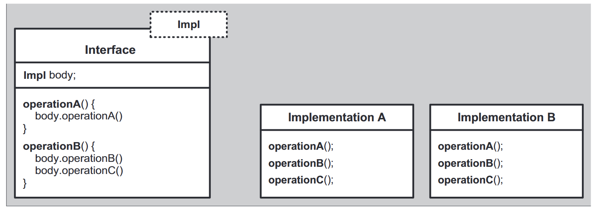

# The Polymorphic Power of Templates

多态性分为动态多态（主要有继承 + 虚函数实现，这是最常用的多态）和静态多态（一般由模板来实现）。

## Dynamic Polymorphism

书上讲的就是用继承 + 虚函数实现的，此处不细说了。

## Static Polymorphism

静态多态使用模板来实现的，此时类不再需要继承 base class，采取如下实现：

```c++
template<typename T>
void drawObj(T const& t) {
  t.draw();
}
```

但是这种实现不再允许异构集合（动态多态可以），所有类型均在编译时确定。

## Dynamic versus Static Polymorphism

### Some Terminology

动态多态是有界的（接口在基类预先设定好了），在运行时绑定的；静态多态是无界的（接口不是预先确定的），在编译器绑定的。

### Strong and Weakness

当然优缺点都是相对的，一句话正说反说而已，不具体展开了。

### Combining Both Forms

可以将这两种结合起来，将在 21 章介绍，比如使用 CRTP 之类的。

## Using concepts

使用静态多态的时候往往需要所有接口均实例化，如果缺失某些接口可能会导致冗长的错误信息。于是可以使用 concept 来完成。

如 foo1()

## New Forms of Design Patterns -- Bridge pattern

感觉就像是 SomethingOther 里面的运行时多态模式，如下图所示：



如果在编译期可以确定 Implementation 接口，可以使用模板来获得更好的性能：



