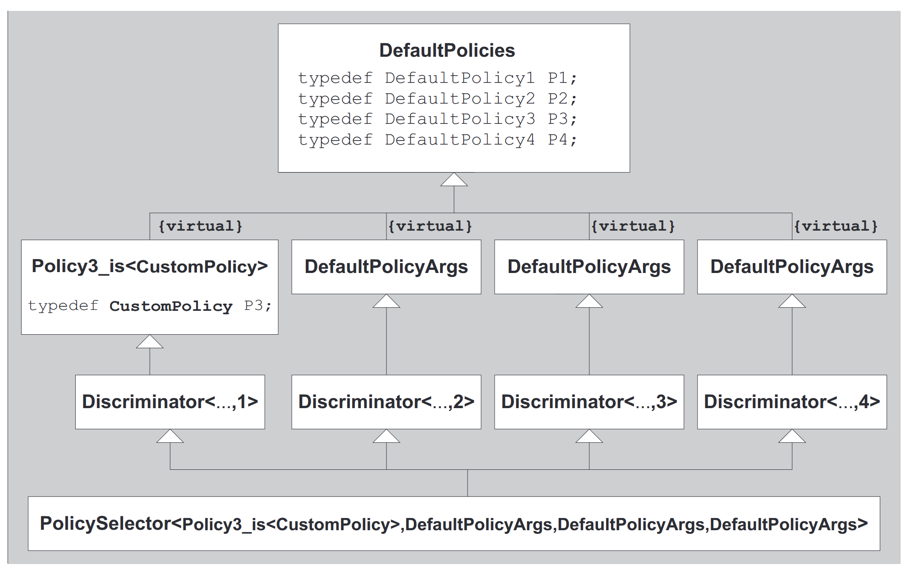

# Implementing Traits

## An Example: Accumulating a Sequence

从最简单的模板开始，首先出现求和值可能不足以存入所有的累加值，故引入 AccumulationTraits，同时针对初始化 0 问题，加入不同的实现。

代码如 accsum.h 所示。

## Traits versus Policies and Policy Classes

### Difference of Traits and Policies

- traits表示自然的额外的模板参数属性(类似于一个模板参数的额外属性)

  - traits作为fixed traits很有用（不需要作为模板参数进行传递）

  - traits参数通常有很自然的默认值（通常很少被复写，或者简单地不能被复写）

  - traits参数倾向于紧密依赖于一个或者多个主参数

  - traits通常组合类型和常量，而不是成员函数

  - traits趋向于收集在特性模板中

- policies表示泛型函数和类型的可配置行为（通常有一些常用的默认值）

  - 如果不是作为模板参数传递，policy类没有什么作用

  - policy参数不需要有默认值，通常可以显式指定（尽管许多通用组件实用默认的policies进行配置）

  - policy参数通常正交于模板的其他参数

  - policy类通常和成员函数组合在一起

  - policies可以收集在普通类或者类模板中

### Member Templates versus Template Template Parameters

对于 policy 有两种实现，如 policy.h

采用了模板成员函数和 template template Parameters。

template template Parameters 的优点：携带一些状态信息（如静态数据成员）比较容易，这些状态信息可以依赖于模板参数。缺点就是表示更加啰嗦。

### Combining Multiple Policies and/or Traits

组合多个 Policies 和 Traits，如何排序？

策略1：根据默认值被使用的概率进行排序。

策略2：可以以任何顺序指定非默认参数，参照 21.4 节（一不小心提前学了）。

### Named Template Arguments

模板参数会存在一些问题：如果指定非默认参数，那么需要指定前面所有的参数，无论是否含有默认值。

解决方法：将默认类型值放在基类中，通过派生覆盖其中一些值。

如 "named_template_args.h" 所示。其中采用了虚继承来去掉二义性问题。



## Type Funtions

- Value functions: Input a value and get a value

- Type functions: Input a type and get a type or constant

下面介绍了一些更加通用的 Type function 可用于 traits


### Element Type

给出容器，返回容器元素的类型，如 TypeFunction/element_type.h。

### Transformation Traits

用于添加或删去引用、const 等类型描述符。

- remove references
  ```c++
  template <typename T> struct RemoveReferenceT { using Type = T; };
  template <typename T> struct RemoveReferenceT<T &> { using Type = T; };
  template <typename T> struct RemoveReferenceT<T &&> { using Type = T; };

  template <typename T>
  using RemoveReference = typename RemoveReferenceT<T>::Type;
  ```

- add references
  ```c++
  template <typename T> struct AddLValueReferenceT { using Type = T &; };
  template <typename T>
  using AddLValueReference = typename AddLValueReferenceT<T>::Type;
  template <typename T> struct AddRValueReferenceT { using Type = T &&; };
  template <typename T>
  using AddRValueReference = typename AddRValueReferenceT<T>::Type;

  template <> struct AddLValueReferenceT<void> { using Type = void; };
  template <> struct AddLValueReferenceT<void const> { using Type = void; };
  template <> struct AddLValueReferenceT<void volatile> { using Type = void; };
  template <> struct AddLValueReferenceT<void const volatile> { using Type = void; };
  ```

- Removing Qualifiers
  通过元函数进行转发。
  ```c++
  #include "removeconst.hpp"
  #include "removevolatile.hpp"
  template<typename T>
  struct RemoveCVT : RemoveConstT<typename RemoveVolatileT<T>::Type> {
  };
  template<typename T>
  using RemoveCV = typename RemoveCVT<T>::Type;
  ```

- Decay
  继承 RemoveCV 并且加了一些特化。详情见 element_type.h。

### Predicate Traits

```c++
using TrueType = BoolConstant<true>;
using FalseType = BoolConstant<false>;
```

TrueType and FalseType 可以作为 tag dispatching，如下面的代码：

```c++
template <typename T> void fooImpl(T, TrueType) {
  std::cout << "fooImpl(T,true) for int called\n";
}
template <typename T> void fooImpl(T, FalseType) {
  std::cout << "fooImpl(T,false) for other type called\n";
}
template <typename T> void foo(T t) {
  fooImpl(t, IsSameT<T, int>{}); // choose impl. depending on whether T is int
}
int main() {
  foo(42);  // calls fooImpl(42, TrueType)
  foo(7.7); // calls fooImpl(42, FalseType)
}
```

注意，为了通用性，所有的库应该保持相同的 `true_type` 和 `false_type` 作为 Tag。C++ 标准库为我们提供了 `std::true_type` 和 `std::false_type`，以后我们都用这个。

### Result Type Traits

首先以 operator template 为例：

观察两个 Array 相加的结果：

```c++
template<typename T>
Array<T> operator+ (Array<T> const&, Array<T> const&);

template<typename T1, typename T2>
Array<???> operator+ (Array<T1> const&, Array<T2> const&);
```

问题：返回 Array 的模板类型应该是什么？

```c++
template <typename T1, typename T2>
Array<typename PlusResultT<T1, T2>::Type> operator+(Array<T1> const &,
                                                    Array<T2> const &);
```

PlusResultT 确定了两种类型相加得到结果的类型，使用 decltype 来实现。

```c++
template <typename T1, typename T2> struct PlusResultT {
  using Type = decltype(T1() + T2());
};
```

然而，decltype 保存有太多的信息了，如还带有引用之类的，这可能不是我们想要的 Type 类型，因此可以使用 RemoveCV 来移除多余的类型：

```c++
template <typename T1, typename T2>
Array<RemoveCV<RemoveReference<PlusResult<T1, T2>>>> operator+(Array<T1> const &,
                                                    Array<T2> const &);
```

但是上述实现要求 T1，T2 是可访问的，默认构造函数不可删除。因此这是一个不必要的限制。我们可以使用 std::declval。

```c++
namespace std {
template<typename T>
  add_rvalue_reference_t<T> declval() noexcept;
}
```

std::declval 返回一个 T 类型的值，不需要默认构造函数。std::declval 仅在 decltype 和 sizeof 等场合使用。此外还有两个特点：

- declval 返回一个右值引用.
- declval 本身不会导致表达式被认为抛出异常

因此可以改写 PlusResultT：

```c++
template <typename T1, typename T2> struct PlusResultT {
  using Type = decltype(std::declval<T1>() + std::declval<T2>());
};
```

## SFINAE-Based Traits

SFINAE 在 Traits 中有两个应用：
- SFINAE out functions overloads and to
- SFINAE out partial specializations

注，重载规则：... 几乎可以和任何类型匹配，但一般其他类型都会比他好。

### SFINAE out functions overloads

使用函数重载，并在模板参数中尝试构造，通过重载决议判断是否选中。具体代码如 SFINAE.h 所示。

在之前的实现中，通过判断返回类型的长度来判断选择哪个函数。然而这会在某些机器上出现问题，可能返回的两个类型长度是相同的。为此，可以构造如下类型返回：

```c++
using Size1T = char;
using Size2T = struct { char a[2]; };
```

我们还可以使用 std::true_type 和 std::false_type 来代替 is_same。

```c++
#include <type_traits>
template <typename T> struct IsDefaultConstructibleHelper {
private:
  // test() trying substitute call of a default constructor for T passed as U:
  template <typename U, typename = decltype(U())>
  static std::true_type test(void *);
  // test() fallback:
  template <typename> static std::false_type test(...);

public:
  using Type = decltype(test<T>(nullptr));
};
template <typename T>
struct IsDefaultConstructibleT : IsDefaultConstructibleHelper<T>::Type {};
```

### SFINAE out partial specializations

使用偏特化完成，如 SFINAE.h。

### Using Generic Lambdas for SFINAE

```c++
// 获取 TypeT (值的辅助模板)
template <typename T> struct TypeT { using Type = T; };
// 获取 TypeT 的实例
template <typename T> constexpr auto type = TypeT<T>{};
// 未评估的上下文中解除包装类型
template <typename T> T valueT(TypeT<T>);
```

对于 isValidImpl，本质上就是 lambda 表达式，看看将 args 放进去 lambda 表达式是否成立。如果成立则返回 std::true_type，否则为 std::false_type。

```c++
template <typename F, typename... Args,
          typename = decltype(std::declval<F>()(std::declval<Args &&>()...))>
std::true_type isValidImpl(void *);

template <typename F, typename... Args> std::false_type isValidImpl(...);
```

对于 isValid，目的是传入 lambda 表达式。注意，返回的是 decltype(){}，否则就是在运行时进行评估的了，不符合 constexpr。

```c++
inline constexpr auto isValid = [](auto x){
  return [](auto && ... args) {
    return decltype(isValidImpl<decltype(f), decltype(args) &&...>(nullptr)){};
  }
}
```

最终构建测试逻辑 lambda 表达式。本质上也是一个 lambda 表达式，将测试的逻辑输入到 isValid 的 f 中。

```c++
constexpr auto IsDefaultConstruct3 =
    isValid([](auto x) -> decltype((void)decltype(valueT(x))()) {});

constexpr auto HasFirst =
    isValid([](auto x) -> decltype((void)valueT(x).fisrt) {});

constexpr auto IsDefaultConstructParamOne =
    isValid([](auto x, auto y) -> decltype(decltype(valueT(x))(valueT(y))) {});
```

最终调用 Isxxx，传递的逻辑是，将 type\<xxx\> 传入到 args 里面，args 会尝试适配 Isxxx 向 isValid 提供的 lambda 表达式中，如果返回值评估没问题就会返回 true_type。

```c++
bool b1 = IsDefaultConstruct3(type<int>);
bool b2 = HasFirst(type<Foo2>);
bool b3 = IsDefaultConstructParamOne(type<Foo2>, type<Foo>);
```


注意，如果要使 SFINAE 发挥作用，替换要发生在立即上下文中。所以在此处，测试的构造放在了返回类型上。

### SFINAE-Friendly Traits

使用 Traits 查询 type 不可以使程序变为 ill-form，这样违背了 traits 的初衷。基于 SFINAE 的 traits 就是将潜在的错误进行捕获并转化为负面结果（不用这个重载）来解决的。

但是之前的 PlusResultT 可能会造成 ill-form：
```c++
template <typename T1, typename T2> struct PlusResultT {
  using Type = decltype(std::declval<T1>() + std::declval<T2>());
};
template <typename T1, typename T2>
using PlusResult = typename PlusResultT<T1, T2>::Type;
```
存在着如下的问题：如果 T1 和 T2 之间的 opertor+ 没有定义，那么会出现 ill-form。

即使我们定义了 T1 T2 相加的重载，也可能发生错误，because C++ does not specify whether the types in a
function template are actually instantiated if another overload would be better.

我们希望判断是否两个 Type 可加放在立即上下文中以确保出发 SFINAE，因此我们采用如下设计：

```c++
template <typename, typename, typename = std::void_t<>>
struct HasPlusT : std::false_type {};

template <typename T1, typename T2>
struct HasPlusT<T1, T2,
                std::void_t<decltype(std::declval<T1>() + std::declval<T2>())>>
    : std::true_type {};

template <typename T1, typename T2, bool = HasPlusT<T1, T2>::value>
struct PlusResultT {
  using Type = decltype(std::declval<T1>() + std::declval<T2>());
};

template <typename T1, typename T2> struct PlusResultT<T1, T2, false> {};

template <typename T1, typename T2>
using PlusResult = typename PlusResultT<T1, T2>::Type;
```

## IsConvertibleT

使用之前技术重写了一个 IsConvertibleT，如 is_converible.h。对于特殊情况的处理：

1. 转换为 array types 应该永远返回 false；

2. 转换为 funtion types 应该永远返回 false；

3. 转换为 void（const void, volatile void）应该永远返回 true。（注意，实现中，parameter 应该不能为 void，所以要处理这个情况）

```c++
template <typename FROM, typename TO,
          bool = std::is_array_v<TO> || std::is_function_v<TO> ||
                 std::is_void_v<TO>>
class IsConvertibleHelper {
public:
  using Type =
      std::integral_constant<bool, std::is_void_v<TO> || std::is_void_v<FROM>>;
};

template <typename FROM, typename TO>
class IsConvertibleHelper<FROM, TO, false> { ... }
```

## Detecting Members

SFINAE-based 另一个 traits 就是判断是否存在成员 T。

### Detecting Member Types

```c++
template <typename, typename = std::void_t<>>
struct hasType : std::false_type {};
template <typename T>
struct hasType<T, std::void_t<typename T::size_type>> : std::true_type {};

template <typename T> constexpr bool hastype = hasType<T>::value;
```

注意：引用类型本身是没有成员的，所以这里我们要去掉引用；同时小心注入类。

### Detecting Arbitrary Member Types

目前检测任意成员类型需要宏来实现：

```c++
#define DETECT_TYPE(type_name)                                                 \
  template <typename, typename = std::void_t<>>                                \
  struct has_Type_##type_name : std::false_type {};                            \
  template <typename T>                                                        \
  struct has_Type_##type_name<                                                 \
      T, std::void_t<typename std::remove_reference_t<T>::type_name>>          \
      : std::true_type {};                                                     \
  template <typename T>                                                        \
  constexpr bool has_type_##type_name = has_Type_##type_name<T>::value;
```

### Detecting Nontype Members

使用以下 trait 判断是否有数据成员 or 成员函数：

```c++
#define DEFINE_HAS_MEMBER(Member)                                              \
  template <typename, typename = std::void_t<>>                                \
  struct HasMemberT_##Member : std::false_type {};                             \
  template <typename T>                                                        \
  struct HasMemberT_##Member<T, std::void_t<decltype(&T::Member)>>             \
      : std::true_type {} // ; intentionally skipped
```

为了使得 true_type 构造有效，需要满足如下条件：

1. Member 必须是 T 没有二义性的成员。（例如，它不能是重载的成员函数名称，或多个继承的同名成员的名称）

2. 成员需要可访问。

3. 成员必须为 non-type，non-enum member。（否则 &T::xxx 中的 & 将会失效）

4. 如果 T::member 是静态数据成员，要求 & 不可以被重写为无法访问。

However，由于上述无法检测带有重载的 funtion，我们可以换一种方法。

```c++
// primary template:
template <typename, typename = std::void_t<>>
struct HasBeginT : std::false_type {};
// partial specialization (may be SFINAE’d away):
template <typename T>
struct HasBeginT<T, std::void_t<decltype(std::declval<T>().begin())>>
    : std::true_type {};
```

类似的，我们也可以检测是否存在各种运算符。

```c++
// primary template:
template <typename, typename, typename = std::void_t<>>
struct HasLessT : std::false_type {};
// partial specialization (may be SFINAE’d away):
template <typename T1, typename T2>
struct HasLessT<T1, T2,
                std::void_t<decltype(std::declval<T1>() < std::declval<T2>())>>
    : std::true_type {};
```

由于 std::void_t<> 的特性，我们可以一下子检测一堆，此处便不在展开。

### Using Generic Lambdas to Detect Members

可以使用 lambda 函数来完成 Detect，可以使用 isValid。

注意：std::declval<xxx>()，xxx 是需要一个类型，如果单纯的使用 valueT(x) 那么接受的是一个值，应该使用 decltype(valueT(x)) 才可以。

```c++
constexpr auto hasFirst =
    isValid([](auto x) -> decltype((void)valueT(x).first) {});

constexpr auto hasSizeType =
    isValid([](auto x) -> typename decltype(valueT(x))::size_type {});

constexpr auto hasLess =
    isValid([](auto x, auto y) -> decltype(std::declval<decltype(valueT(x))>() <
                                           std::declval<decltype(valueT(y))>()) {});
// or ...
constexpr auto hasLess =
    isValid([](auto x, auto y) -> decltype(valueT(x) < valueT(y)) {});
```

## Other Traits Techniques

### If-Then-Else

```c++
template <bool b, typename TrueType, typename FalseType> struct IfThenElseT {
  using Type = TrueType;
};

template <typename TrueType, typename FalseType>
struct IfThenElseT<false, TrueType, FalseType> {
  using Type = FalseType;
};

template <bool b, typename TrueType, typename FalseType>
using IfThenElse = typename IfThenElseT<b, TrueType, FalseType>::Type;

template <auto N> struct SmallestIntT {
  using Type = typename IfThenElseT<
      N <= std::numeric_limits<char>::max(), char,
      typename IfThenElseT<
          N <= std::numeric_limits<short>::max(), short,
          typename IfThenElseT<
              N <= std::numeric_limits<int>::max(), int,
              typename IfThenElseT<
                  N <= std::numeric_limits<long>::max(), long,
                  typename IfThenElseT<
                      N <= std::numeric_limits<long long>::max(),
                      long long, // then
                      void       // fallback
                      >::Type>::Type>::Type>::Type>::Type;
};
```
注意，模板中 True 和 False 分支都是会评估的，因此需要保证这两个分支都是正确的，比如要对一个数进行 unsigned：

```c++
// ERROR: undefined behavior if T is bool or no integral type:
template <typename T> struct UnsignedT {
  using Type =
      IfThenElse<std::is_integral<T>::value && !std::is_same<T, bool>::value,
                 typename std::make_unsigned<T>::type, T>;
};
```
使用 bool 会报错的。可以考虑加入 traits 解决该问题：

```c++
// yield T when using member Type:
template <typename T> struct IdentityT { using Type = T; };
// to make unsigned after IfThenElse was evaluated:
template <typename T> struct MakeUnsignedT {
  using Type = typename std::make_unsigned<T>::type;
};
template <typename T> struct UnsignedT {
  using Type = typename IfThenElse<std::is_integral<T>::value &&
                                       !std::is_same<T, bool>::value,
                                   MakeUnsignedT<T>, IdentityT<T>>::Type;
};
```
值得注意的是，在调用 ::Type 之前，MakeUnsignedT 和 IdentityT 都不会完整实例化，但是如果使用 MakeUnsigneT\<T\> 的话，是不起作用，还是出错的，因为这会导致 MakeUnsigneT 立即实例化而引发 bool make_unsigned 的错误。

### Detecting Nonthrowing Operations

比如一个类的移动构造函数是否是 nonthrow 的取决于其成员和基类的移动构造函数是否抛出异常。

```c++
template <typename T1, typename T2> class Pair {
  T1 first;
  T2 second;

public:
  Pair(Pair &&other)
      : first(std::forward<T1>(other.first)),
        second(std::forward<T2>(other.second)) {}
};
```

可以在移动构造函数中：

```c++
Pair(Pair &&other) noexcept(IsNothrowMoveConstructibleT<T1>::value
                                &&IsNothrowMoveConstructibleT<T2>::value)
    : first(std::forward<T1>(other.first)),
      second(std::forward<T2>(other.second)) {}
```

如何实现 IsNothrowMoveConstructibleT？

```c++
template <typename T>
struct IsNothrowMoveConstructibleT
    : std::bool_constant<noexcept(T(std::declval<T>()))> {};
```

但是这不是 SFINAE Friendly 的。因此我们采用如下设计：

```c++
// primary template:
template <typename T, typename = std::void_t<>>
struct IsNothrowMoveConstructibleT : std::false_type {};
// partial specialization (may be SFINAE’d away):
template <typename T>
struct IsNothrowMoveConstructibleT<T,
                                   std::void_t<decltype(T(std::declval<T>()))>>
    : std::bool_constant<noexcept(T(std::declval<T>()))> {};
```

请注意，如果无法直接调用移动构造函数，则无法检查它是否抛出异常。也就是说，移动构造函数是**公共的且不被删除**是不够的，它还要求**相应的类型不是抽象类**（指向抽象类的引用或指针可以正常工作）。因此，该类型特征被命名为 IsNothroMoveConstructible，而不是 HasNothroMoveConstructor。对于其他任何事情，我们需要编译器支持。


### Traits Convenience

type traits 组合起来可能很冗长，比如：

```c++
template <typename T1, typename T2>
Array<typename RemoveCVT<
    typename RemoveReferenceT<typename PlusResultT<T1, T2>::Type>::Type>::Type>
operator+(Array<T1> const &, Array<T2> const &);
```

- Alias Templates and Traits

  一种方法是使用别名代替 ::type：

  ```c++
  template<typename T>
  using RemoveCV = typename RemoveCVT<T>::Type;
  template<typename T>
  using RemoveReference = typename RemoveReferenceT<T>::Type;
  template<typename T1, typename T2>
  using PlusResult = typename PlusResultT<T1, T2>::Type;
  ```

  该方法会存在一些缺点：

  1. 无法特化

  2. 别名可能会让人困惑

  3. Alias 往往会实例化 type

  注：别名不可以和元函数转发一起用。（19.3.2）

  现在标准库中从 C++14 开始会有别名。可以用。

- Variable Templates and Traits
  
  可以使用 constexpr 变量模板减少冗余 ::value，同时 C++ 标准库里也给出了 _v 的后缀表示。


## Type Classification

### 基本类型

std::is_fundamental，书中用 SFINAE 实现的。

### 复合类型

Simple compound types include pointer types, lvalue and rvalue reference types, pointer-to-member types, and array types.

许多乱七八糟的，之前看过，这里就不写了。

### Identifying Function Type

注：当函数类型被标记为 const 时，它引用隐式参数 this 指向的对象上的限定符，而 const 类型上的 const 是指对象真实类型是 const。因此对该类型需要进行偏特化。

### 类类型

这里用到了一个 trick：只有类类型可以用作指向成员类型的指针的基础。也就是说，在 X Y::* 形式的类型构造中，Y 只能是类类型。

```c++
template <typename T, typename = std::void_t<>>
struct IsClassT : std::false_type { // primary template: by default no class
};
template <typename T>
struct IsClassT<T, std::void_t<int T::*>> // classes can have pointer-to-member
    : std::true_type {};
```

### 枚举类型

书上的实现：如果这个类型不是以上提到的所有类型，那他就是枚举类型。好家伙。

编译器会有专门特殊的实现。

## Policy Traits

Property traits：what sort of type they represent, the result type of an operator applied to values of that type, and so forth.

Policy Traits：How some types should be treated.

### Read-only Parameter Traits

对于某些函数参数，按值传递开销很大，一般都用 const& 传递。

```c++
template<typename T>
struct RParam {
  using Type =
      typename IfThenElseT<sizeof(T) <= 2 * sizeof(void *), T, T const &>::Type;
};
```

container type 往往都用常引用传递更好，于是特化：

```c++
template <typename T> struct RParam<Array<T>> {
  using Type = Array<T> const &;
};
```

可以引入 C++ 标准库的关键字判断是否需要常引用：

```c++
template <typename T> struct RParam {
  using Type = IfThenElse<(sizeof(T) <= 2 * sizeof(void *) &&
                           std::is_trivially_copy_constructible<T>::value &&
                           std::is_trivially_move_constructible<T>::value),
                          T, T const &>;
};
```

所以便可以进行如下的应用：

```c++
// function that allows parameter passing by value or by reference
template <typename T1, typename T2>
void foo(typename RParam<T1>::Type p1, typename RParam<T2>::Type p2) {
  ...
}
int main() {
  MyClass1 mc1;
  MyClass2 mc2;
  foo<MyClass1, MyClass2>(mc1, mc2);
}
```

但是存在如下问题：函数参数更加混乱，以及，对于 foo 函数，无法直接推导出模板类型，需要显式调用。

笨拙的解决办法：完美转发。

```c++
// function that allows parameter passing by value or by reference
template <typename T1, typename T2>
void foo_core(typename RParam<T1>::Type p1, typename RParam<T2>::Type p2) {
  ...
}
// wrapper to avoid explicit template parameter passing
template <typename T1, typename T2> void foo(T1 &&p1, T2 &&p2) {
  foo_core<T1, T2>(std::forward<T1>(p1), std::forward<T2>(p2));
}
int main() {
  MyClass1 mc1;
  MyClass2 mc2;
  foo(mc1, mc2); // same as foo_core<MyClass1,MyClass2>(mc1,mc2)
}
```

## In Standard Library

C++ 标准库目前支持很多 traits，尽可能的用标准库里面的。

## Afternotes

1. traits 可以用作一种编译期反射，在模板元编程中很有用。

2. 没了。

3. 本章将了 traits 相关的东西，也简单的实现了一些 traits 并弄清了原理。感觉最重要的是强化了 SFINAE 的使用。