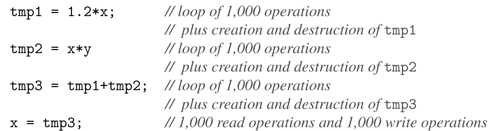
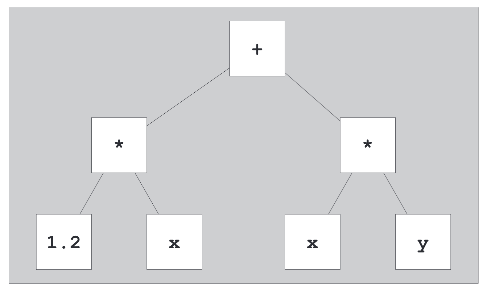

表达式模板，最开始是为了支持数值数组类提出的，后文也将详细介绍。

数值数组类支持对整个数组对象进行数值运算。例如，可以将两个数组相加，结果包含的元素是参数数组中相应值的总和。类似地，整个数组可以乘以一个标量，这意味着数组的每个元素都被缩放。当然，希望保留对于内置标量类型非常熟悉的运算符表示法。

```c++
Array<double> x(1000), y(1000);

// ...

x = 1.2 * x + y;
```

表达式模板让人想起模板元编程，部分原因是表达式模板有时**依赖于深度嵌套的模板实例化**，这与模板元程序中遇到的递归实例化没有什么不同。事实上，这两种技术最初都是为了支持高性能数组操作而开发的，这也可能让人感觉它们是相关的。

当然，这些技术是互补的。例如，**元编程对于小型固定大小的数组很方便，而表达式模板对于运行时大小的中型到大型数组的操作非常有效**。

# Temporaries and Split Loops

为了引出表达式模板，让我们从一种简单的（或者可能是幼稚的）方法开始来实现支持数值数组操作的模板。基本数组模板可能如 sarray.h 所示（SArray 代表简单数组）。

但是以上的实现会出现两个问题：

1. 运算符的每次应用（赋值除外）都会创建至少一个临时数组（即，在我们的示例中，假设编译器执行所有允许的临时复制消除，则至少创建三个大小各为 1,000 的临时数组）。

2. 运算符的每次应用都需要对参数和结果数组进行额外的遍历（在我们的示例中，假设仅生成三个临时 SArray 对象，则读取大约 6,000 个双精度值，写入大约 4,000 个双精度值）。

对于 x = 1.2*x + x*y 将会发生一下的若干操作：



对于更加大型的数组，这样实现带来的中间变量可能太大，内存没有足够空间来存储。数值数组库的早期实现面临着这个问题，并鼓励用户使用计算赋值（例如 +=、*= 等）。这些分配的优点是参数和目标均由调用者提供，因此不需要临时变量。

显然，这样的实现还是存在着缺陷：

1. 符号变得非常笨拙；

2. 仍然留下了一个不需要的临时变量；

3. 循环分为多个操作，总共需要从内存中读取大约 6,000 个双精度型元素，并将 4,000 个双精度型元素写入内存。

我们真正想要的是一个“理想循环”来处理每个索引的整个表达式：

```c++
int main() {
  SArray<double> x(1000), y(1000);
  // ... 
  for (int idx = 0; idx < x.size(); ++idx) {
    x[idx] = 1.2 * x[idx] + x[idx] * y[idx];
  }
}
```

# Encoding Expressions in Template Arguments

解决我们问题的关键是，**在看到整个表达式之前不要尝试计算表达式的一部分**（在我们的示例中，直到调用赋值运算符）。因此，在评估之前，我们必须记录哪些操作应用于哪些对象。这些操作是在编译时确定的，因此可以在模板参数中进行编码。

这意味着 1.2\*x 的结果不是一个新数组，而是一个表示 x 的每个值乘以 1.2 的对象。类似地，x\*y 必须将 x 的每个元素乘以 y 的每个对应元素。最后，当我们需要结果数组的值时，我们会进行存储以供以后评估的计算。

我们将新的基本 Array 类模板与类模板 A_Scalar、A_Add 和 A_Mult 结合起来。你可能会认识到与该表达式相对应的语法树的前缀表示。这个嵌套的 template-id 表示所涉及的操作以及应应用该操作的对象的类型。 A_Scalar 稍后会介绍，但本质上只是数组表达式中标量的占位符。



## Operands of the Expression Templates

为了完成表达式的表示，我们必须在 A_Add 和 A_Mult 对象中存储对参数的引用，并在 A_Scalar 对象中记录标量的值（或其引用）。相应操作数的可能定义见 props.h。

我们添加了下标和大小查询操作，使我们能够计算由以给定对象为根的节点子树表示的操作所产生的数组元素的大小和值。对于仅涉及数组的运算，结果的大小是任一操作数的大小。但是，对于同时涉及数组和标量的运算，结果的大小就是数组的大小。

为了区分数组操作数和标量操作数，我们将标量的大小定义为零。

注意，此处使用了引用的 traits，这是必要的，因为一般来说，我们可以将它们声明为引用，因为大多数临时节点都绑定在顶级表达式中，因此一直存在到该完整表达式的求值结束为止。 A_Scalar 节点是一个例外。它们绑定在运算符函数内，并且可能直到完整表达式的计算结束才存在。因此，为了避免成员引用不再存在的标量，必须按值复制 A_Scalar 操作数。

```c++
typename A_Traits<OP1>::ExprRef op1; // first operand
typename A_Traits<OP2>::ExprRef op2; // second operand
```

换句话说，我们需要这样的成员：

- 对于通用的常引用：`OP const& op`

- 对于标量值：`OP op`

这是 traits 类完美的引用场景，我们编写如下 traits：

```c++
template <typename T> class A_Traits {
public:
  using ExprRef = T const &;
};

template <typename T> class A_Traits<A_Scalar<T>> {
public:
  using ExprRef = A_Scalar<T>;
};
```

请注意，由于 A_Scalar 对象引用顶级表达式中的标量，因此这些标量可以使用引用类型。也就是说，`A_Scalar<T>::s` 是引用成员。

## The Array Type

凭借我们使用轻量级表达式模板对表达式进行编码的能力，我们现在必须创建一个控制实际存储并了解表达式模板的数组类型。然而，出于工程目的，保持具有存储的真实数组的接口与用于生成数组的表达式的表示的接口尽可能相似也是有用的。为此，我们将Array模板声明如下：

`template<typename T, typename Rep = SArray<T>> class Array;`

如果 Array 是真实的存储数组，则 Rep 类型可以是 SArray，或者它可以是嵌套的模板 ID，例如编码表达式的 A_Add 或 A_Mult。无论哪种方式，我们都在处理数组实例，这大大简化了我们以后的处理。事实上，即使是 Array 模板的定义也不需要专门化来区分这两种情况，尽管某些成员无法实例化为 A_Mult 等类型来替代 Rep。

定义如 array.h 所示。该功能大致限于我们的 SArray 模板提供的功能，尽管一旦理解了代码，添加该功能并不难。

正如您所看到的，许多操作只是转发到底层的 Rep 对象。然而，当复制另一个数组时，我们必须考虑到另一个数组实际上是建立在表达式模板上的可能性。因此，我们根据底层 Rep 表示来参数化这些复制操作。

下标运算符值得稍微讨论一下。请注意，该运算符的 const 版本使用 decltype 的返回类型，而不是更传统的类型 T const&。我们这样做是因为如果 Rep 表示是 A_Mult 或 A_Add，则其下标运算符返回一个临时值（即纯右值），该值不能通过引用返回（并且 decltype(auto) 将为纯右值情况推导出非引用类型）。另一方面，如果 Rep 是 `SArray<T>`，则底层下标运算符会生成 const 左值，并且推导的返回类型将是该情况的匹配 const 引用。

## The Operators

除了运算符本身之外，我们拥有大部分机制来为我们的数字数组模板提供高效的数字运算符。正如前面所暗示的，这些运算符仅组装表达式模板对象，它们实际上并不计算结果数组。对于每个普通的二元运算符，我们必须实现三个版本：数组-数组、数组-标量和标量-数组。例如，为了能够计算我们的初始值，我们需要以下运算符：

这些运算符的声明有些麻烦（从这些示例中可以看出），但函数确实没有做太多事情。例如，两个数组的加运算符首先创建一个 A_Add<> 对象，该对象表示运算符和操作数 `A_Add<T,R1,R2>(a.rep(),b.rep())`。

```c++
// addition of two Arrays:
template <typename T, typename R1, typename R2>
Array<T, A_Add<T, R1, R2>> operator+(Array<T, R1> const &a,
                                     Array<T, R2> const &b) {
  return Array<T, A_Add<T, R1, R2>>(A_Add<T, R1, R2>(a.rep(), b.rep()));
}
// multiplication of two Arrays:
template <typename T, typename R1, typename R2>
Array<T, A_Mult<T, R1, R2>> operator*(Array<T, R1> const &a,
                                      Array<T, R2> const &b) {
  return Array<T, A_Mult<T, R1, R2>>(A_Mult<T, R1, R2>(a.rep(), b.rep()));
}
// multiplication of scalar and Array:
template <typename T, typename R2>
Array<T, A_Mult<T, A_Scalar<T>, R2>> operator*(T const &s,
                                               Array<T, R2> const &b) {
  return Array<T, A_Mult<T, A_Scalar<T>, R2>>(
      A_Mult<T, A_Scalar<T>, R2>(A_Scalar<T>(s), b.rep()));
}
```

## Review

对于下面的代码我们进行展开分析：

```c++
int main() {
  Array<double> x(LENGTH), y(LENGTH);
  // ...
  x = 1.2 * x + y;
}
```

由于 x 和 y 的定义中省略了 Rep 参数，因此将其设置为默认值，即 SArray<double>。因此，x 和 y 是具有“真实”存储的数组，而不仅仅是操作的记录。

对于表达式：`x = 1.2 * x + y;`，编译器首先应用最左边的 * 操作，它是一个标量数组运算符。因此，重载解析选择了操作符*的标量数组形式：

```c++
template <typename T, typename R2>
Array<T, A_Mult<T, A_Scalar<T>, R2>> operator*(T const &s,
                                               Array<T, R2> const &b) {
  return Array<T, A_Mult<T, A_Scalar<T>, R2>>(
      A_Mult<T, A_Scalar<T>, R2>(A_Scalar<T>(s), b.rep()));
}
```

操作数类型为 `double` 和 `Array<double, SArray<double>>`。因此，结果的类型是 `Array<double, A_Mult<double, A_Scalar<double>, SArray<double>>>`。

结果值被构造为引用由 double 值 1.2 和对象 x 的 `SArray<double>` 表示形式构造的 `A_Scalar<double>` 对象。接下来，计算第二个乘法：它是数组-数组运算 `x*y`。这次我们使用适当的运算符*：

```c++
template <typename T, typename R1, typename R2>
Array<T, A_Mult<T, R1, R2>> operator*(Array<T, R1> const &a,
                                      Array<T, R2> const &b) {
  return Array<T, A_Mult<T, R1, R2>>(A_Mult<T, R1, R2>(a.rep(), b.rep()));
}
```

操作数类型均为 `Array<double, SArray<double>>`，因此结果类型为 `Array<double, A_Mult<double, SArray<double>, SArray<double>>>`。

最后，评估 + 运算。这又是一个数组-数组运算，操作数类型就是我们刚刚推导的结果类型。因此，我们调用数组-数组运算符 +。

T 被替换为 double，而 R1 被替换为 `A_Mult<double, A_Scalar<double>, SArray<double>>`，R2 被替换为 `A_Mult<double, SArray<double>, SArray<double>>` 因此，赋值标记右侧的表达式是：

```c++
Array<double,
  A_Add<double,
    A_Mult<double, A_Scalar<double>, SArray<double>>,
    A_Mult<double, SArray<double>, SArray<double>>>>
```

赋值运算符通过将下标运算符应用于右侧的表示来计算目标 x 的每个元素。

仔细追踪这个下标运算符会发现，对于给定的下标 idx，它计算：`(1.2*x[idx]) + (x[idx]*y[idx])`，这正是我们想要的。

## Expression Templates Assignments

无法使用基于示例 A_Mult 和 A_Add 表达式模板构建的 Rep 参数来实例化数组的写入操作。 （事实上​​，编写 a+b = c 是没有意义的。）但是，编写其他可以对结果进行赋值的表达式模板是完全合理的。比如：

`x[y] = 2 * x[y]`

应该代表着

```c++
for (std::size_t idx = 0; idx<y.size(); ++idx) {
  x[y[idx]] = 2*x[y[idx]];
}
```

启用此功能意味着基于表达式模板构建的数组的行为类似于左值（即可写）。其表达式模板组件与 A_Mult 等并没有本质上的不同，只是提供了 const 和非常量版本的下标运算符，并且它们可能返回左值（引用）：

```c++
template <typename T, typename A1, typename A2> class A_Subscript {
public:
  // constructor initializes references to operands
  A_Subscript(A1 const &a, A2 const &b)
      : a1(a), a2(b) {} // process subscription when value requested
  decltype(auto) operator[](std::size_t idx) const { return a1[a2[idx]]; }
  T &operator[](std::size_t idx) { return a1[a2[idx]]; }
  // size is size of inner array
  std::size_t size() const { return a2.size(); }

private:
  A1 const &a1; // reference to first operand
  A2 const &a2; // reference to second operand
};
```

同样，decltype(auto) 可以方便地处理数组的下标，而不管底层表示是否生成纯右值或左值。前面建议的具有子集语义的扩展下标运算符需要将其他下标运算符添加到数组模板中。这些运算符之一可以定义如下（可能还需要相应的 const 版本）：

```c++
template<typename T, typename R>
  template<typename T2, typename R2>
Array<T, A_Subscript<T, R, R2>>
Array<T, R>::operator[](Array<T2, R2> const& b) {
  return Array<T, A_Subscript<T, R, R2>>
    (A_Subscript<T, R, R2>(*this, b));
}
```

# Performance and Limitations of Expression Templates

为了证明表达式模板思想的复杂性，我们已经在数组操作上调用了大大增强的性能。当您跟踪表达式模板发生的情况时，您会发现许多小型内联函数相互调用，并且许多小型表达式模板对象在调用堆栈上分配。优化器必须执行完整的内联和消除小对象，以生成执行与手动编码的循环一样的代码。在本书的第一版中，我们报告说很少有编译器可以实现这样的优化。从那时起，情况有了很大改善，毫无疑问，部分原因是该技术已被证明很受欢迎。

表达式模板技术并不能解决涉及数组数值运算的所有问题情况。例如，它不适用于以下形式的矩阵向量乘法：

`x = A * x`

其中 x 是大小为 n 的列向量，A 是 n×n 矩阵。这里的问题是必须使用临时值，因为结果的每个元素都可以依赖于原始 x 的每个元素。不幸的是，表达式模板循环立即更新 x 的第一个元素，然后使用新计算的元素来计算第二个元素，这是错误的。表达方式略有不同

`x = A * y`

另一方面，如果 x 和 y 不是彼此的别名，则不需要临时变量，这意味着解决方案必须在运行时知道操作数的关系。这反过来又建议创建一个表示表达式树的运行时结构，而不是用表达式模板的类型对树进行编码。

# Afternotes

表达式模板是由 Todd Veldhuizen 和 David Vandevoorde（Todd 创造了这个术语）独立开发的，当时成员模板还不是 C++ 编程语言的一部分（而且当时它们似乎永远不会被添加到 C++ 中）。这在实现赋值运算符时导致了一些问题：无法为表达式模板进行参数化。解决这个问题的一种技术是在表达式模板中引入一个转换运算符，转换为使用表达式模板参数化的 Copier 类，但继承自仅在元素类型中参数化的基类。然后，该基类提供了赋值运算符可以引用的（虚拟）copy_to 接口。

以下是该机制的草图（包含本章中使用的模板名称）：

```c++
template <typename T> class CopierInterface {
public:
  virtual void copy_to(Array<T, SArray<T>> &) const;
};
template <typename T, typename X> class Copier : public CopierInterface<T> {
public:
  Copier(X const &x) : expr(x) {}
  virtual void copy_to(Array<T, SArray<T>> &) const {
    // implementation of assignment loop
    // ...
  }

private:
  X const &expr;
};
template <typename T, typename Rep = SArray<T>> class Array {
public:
  // delegated assignment operator
  Array<T, Rep> &operator=(CopierInterface<T> const &b) { b.copy_to(rep); };
  // ...
};
template <typename T, typename A1, typename A2> class A_mult {
public:
  operator Copier<T, A_Mult<T, A1, A2>>();
  // ...
};
```

这又增加了表达式模板的复杂性和一些额外的运行时成本，但即便如此，所带来的性能优势在当时还是令人印象深刻的。 

C++ 标准库包含一个类模板 valarray，该模板旨在用于证明本章开发的数组模板所用技术的合理性的应用程序。 valarray 的前身的设计目的是让针对科学计算市场的编译器能够识别数组类型并使用高度优化的内部代码进行操作。这样的编译器在某种意义上会“理解”这些类型。然而，这从未发生过（部分是因为相关市场相对较小，部分是因为随着 valarray 成为模板，问题变得越来越复杂）。在表达式模板技术被发现一段时间后，我们中的一个人（Vandevoorde）向 C++ 委员会提交了一份提案，该提案将 valarray 本质上转变为我们开发的数组模板（其中许多附加功能受到现有 valarray 功能的启发）。该提案首次记录了 Rep 参数的概念。在此之前，实际存储的数组和表达式模板伪数组是不同的模板

当客户端代码引入接受数组的函数 foo() 时，例如 

`double foo(Array<double> const&);`

调用 foo(1.2*x) 会强制将表达式模板转换为具有实际存储的数组，即使应用于该参数的操作不需要临时变量。通过将表达式模板嵌入到 Rep 参数中，可以改为声明 

`template<typename Rep> double foo(Array<double, Rep> const&);`

除非确实需要，否则不会发生转换。

Valarray 提案在 C++ 标准化进程中出现得较晚，几乎重写了标准中有关 valarray 的所有文本。结果它被拒绝了，相反，对现有文本进行了一些调整，以允许基于表达式模板的实现。然而，利用这一津贴仍然比这里讨论的要麻烦得多。在撰写本文时，还没有这样的实现，而且一般来说，标准 valarray 在执行其设计的操作时效率相当低。

最后，值得注意的是，本章中介绍的许多开创性技术以及后来被称为 STL 的技术最初都是在同一个编译器上实现的：Borland C++ 编译器的第 4 版。这可能是第一个使模板编程在 C++ 编程社区中广泛流行的编译器。表达式模板最初主要应用于类似数组类型的操作。然而，几年后，新的应用被发现了。其中最具突破性的是 Jaakko J̈arvi 和 Gary Powell 的 Boost.Lambda 库（参见 [LambdaLib]），它在 lambda 表达式成为核心语言功能之前几年就提供了可用的 lambda 表达式工具，以及 Eric Niebler 的 Boost.Proto 库，它是一个元程序表达式模板库，其目标是在 C++ 中创建嵌入式领域特定语言。其他 Boost 库（例如 Boost.Fusion 和 Boost.Hana）也充分利用了表达式模板。 标准模板库 (STL) 彻底改变了 C++ 库的世界，后来成为 C++ 标准库的一部分（请参阅 [JosuttisStdLib]）。Jaakko 在开发核心语言功能方面也发挥了重要作用。
